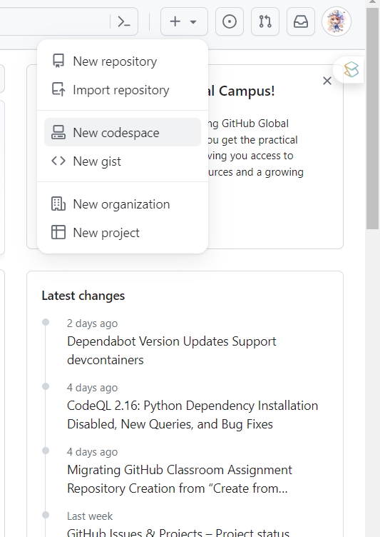
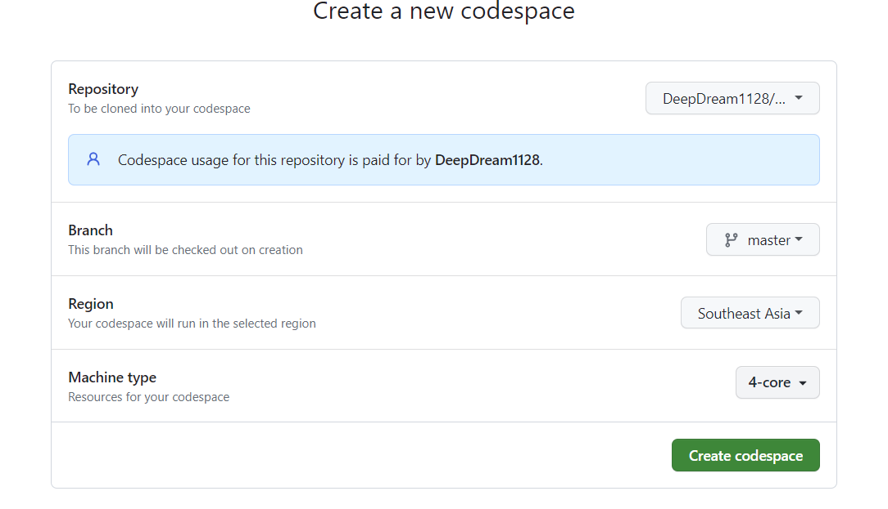
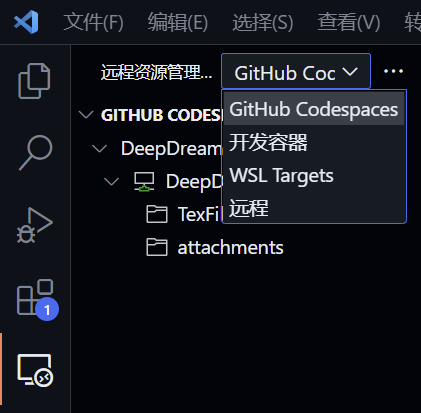

# 适用人群

希望使用全套latex，同时希望使用vscode作为编辑工具，但是本机空间不足的人。

# 教程

## 0.前置条件

1. vscode+远程连接插件+LaTeX Workshop
2. GitHub Pro账户（学生认证即可获得）[参照这里](https://docs.github.com/zh/education/explore-the-benefits-of-teaching-and-learning-with-github-education/github-global-campus-for-students/apply-to-github-global-campus-as-a-student)
3. 手

## 1. 创建一个仓库

用于存储你的latex文档, 同时作为codespace运行的位置

}

## 2. 创建Codespace

头像旁的加号下，点击New Codespace



选择之前创建的仓库，并自选配置，一般学生包给的免费时长都用不完，所以配置拉满就行，地区选择离自己的梯子近一点的。



## 3. Vscode 配置

### 3.1 连接Codespace

打开vscode的远程资源管理器，在下拉选项中选择GitHub Codespace，就可以看到刚刚的创建的Codespace容器，双击连接即可。



### 3.2 必要插件安装

如果有云同步应该会将你的vscode的插件同步过来，如果没有的话，在插件市场搜索LaTeX Workshop即可

### 3.3 指令行安装texlive

内存是足够的，直接装完整版即可。由于是GitHub的服务器，不需要换源.

```shell
sudo apt-get install texlive-full
```

安装完后重启vscode，就可以使用vscode撰写latex了

LaTeX工具链教程可见[此处（看后半段就行）](https://zhuanlan.zhihu.com/p/166523064)

a